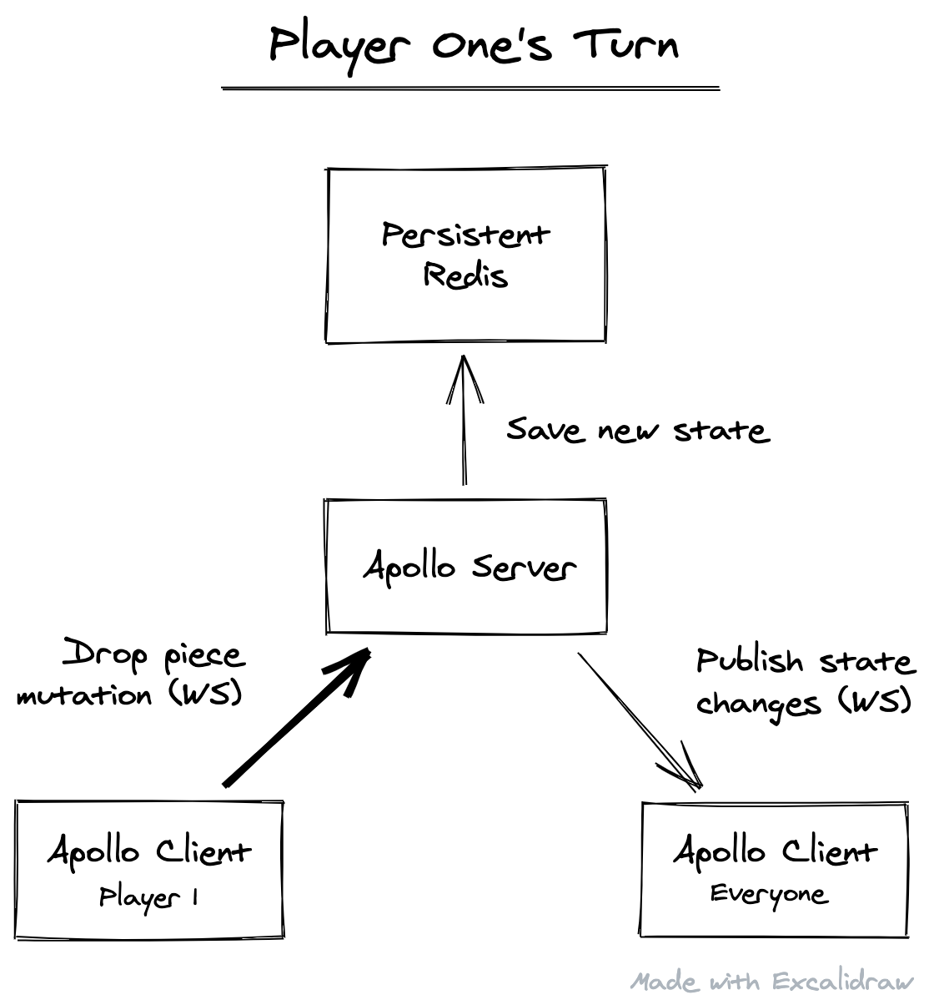

# Board Game Server

Backend server for a generic board game. Design goals:

- Easy to extend for any turn-based game implementation
- Effortless game hosting and joining, with no authentication
- Typed realtime API via GraphQL subscriptions
- Persistance via Redis so a game can be dropped and picked up at any time by anyone

## Overview

## Development

### Server (port 4000)

- `cd server`
- `yarn install` to install JS/TS packages
- `yarn dev-redis` to start Redis in Docker
- `yarn dev` to start devserver and auto-generate nexus schema

**For deployment, set the env vars:**

- `REDIS_HOST`: The host of the Redis server
- `REDIS_PORT`: The port of the Redis server

### Client (port 3000)

- `cd client`
- `yarn install` to install JS/TS packages
- `yarn dev` to start devserver

**For deployment, set the env vars:**

- `REACT_APP_SERVER_ENDPOINT`: The URL of the server
- `REACT_APP_URL_BASE`: Used to determine share URLs, etc

## Caveats

There is an assumption that a single game is hosted by a single Node server. Race conditions with Redis when multiple Node servers access the same game are not accounted for.
